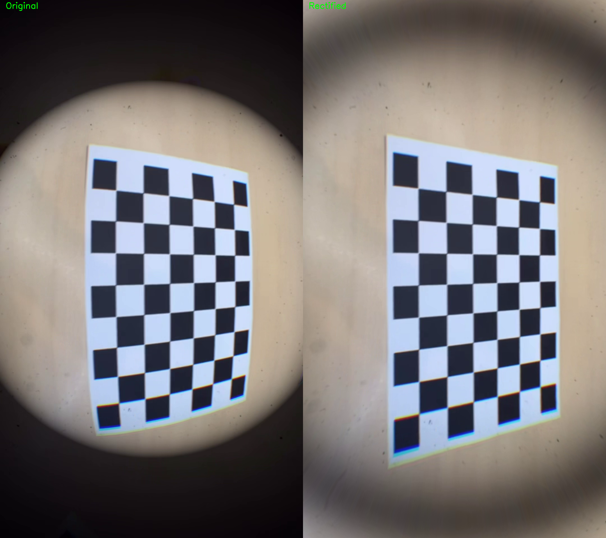

# Camera Calibration and Distortion Correction

## 1. 개요
본 과제에서는 체스보드 패턴을 이용하여 카메라 캘리브레이션을 수행하고,  
추정된 파라미터를 이용하여 렌즈 왜곡을 보정한다.

목표는 다음과 같다:
- 카메라의 내부 파라미터(intrinsic parameters) 추정
- 렌즈 왜곡(distortion) 보정

---

## 2. Camera Calibration

### 캘리브레이션 결과

- RMS error: 0.480710

#### Camera Matrix (K)

[1304.392481, 0.000000, 533.629537]  

[0.000000, 1299.298948, 957.761555]  

[0.000000, 0.000000, 1.000000]  

#### 파라미터
- fx = 1304.392481  
- fy = 1299.298948  
- cx = 533.629537  
- cy = 957.761555  

#### Distortion Coefficients

k1 = -0.399810075  

k2 = -0.159856714  

p1 = 0.000433834  

p2 = 0.005150458  

k3 = -0.310017296  

---

## 3. 왜곡 보정 (Distortion Correction)

캘리브레이션으로 얻은 파라미터를 이용하여 OpenCV의 `cv.undistort()`를 사용해  
렌즈 왜곡을 보정하였다.

### 결과 비교

